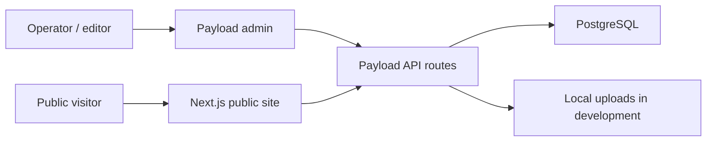

# Architecture

The EMBA Activity Archive is a pnpm monorepo with one web application, shared package placeholders, and local development infrastructure.

## Current Runtime Shape

## Applications

### `apps/web`

The web app owns both the public experience and the operator-facing CMS surface.

- `src/app/(site)`: public App Router routes.
- `src/app/(payload)`: Payload admin and API route integration.
- `src/collections`: Payload collections.
- `src/styles`: global CSS and design token imports.
- `payload.config.ts`: Payload admin, database, editor, collection, and type generation configuration.

This keeps Node 0 simple: one deployable app can serve public pages and CMS routes while the project is still small.

## Packages

### `packages/content-schema`

Reserved for shared content lifecycle and schema contracts. Node 0 currently exposes the content status vocabulary so later nodes can avoid duplicating lifecycle strings.

### `packages/design-tokens`

Reserved for shared design primitives. Node 0 currently exports breakpoint values and defines CSS token entry points in the web app.

## Infrastructure

### `infra/dev`

Local development infrastructure lives here. Node 0 uses Docker Compose for PostgreSQL so Payload can run against a predictable database during development.

## Data Flow

1. Operators create and manage content in Payload admin.
2. Payload persists structured content in PostgreSQL.
3. Uploaded media is handled by Payload; Node 0 uses local development storage.
4. Public pages read from the app/CMS layer in later nodes.

## Node 0 Architectural Decisions

- Use one Next.js app for both public pages and CMS integration.
- Keep shared packages minimal until there is real cross-boundary reuse.
- Keep local infrastructure under `infra/dev` so production infrastructure can be designed separately.
- Use documentation as the handoff contract between nodes.

## Deferred Decisions

Later nodes should decide:

- Production database hosting and migration flow.
- Production media storage.
- Public content model for activities, albums, people, and videos.
- Role-based CMS access rules beyond the Node 0 role vocabulary.
- Deployment and preview environment strategy.
